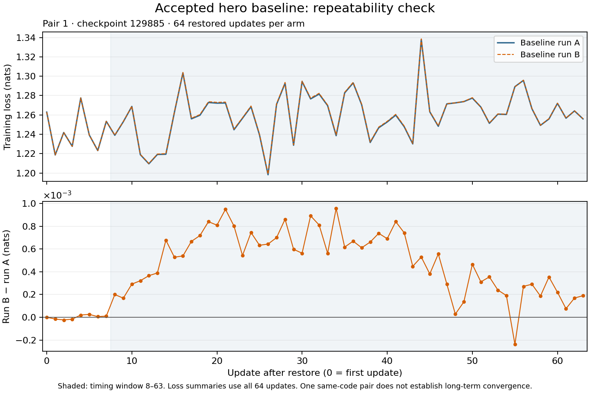

# Hero baseline: numerical repeatability after checkpoint restore

Two runs of identical accepted-baseline code on the same 64 NVIDIA GB200 GPUs produced different losses at 63 of 64 updates, despite matching all 4,096 paired input fingerprints. The maximum absolute difference was 0.000957 nats. This establishes same-code variation in this pair; its cause remains unresolved. The inverse-routing optimization remains outside the accepted baseline.

The [earlier inverse-routing comparison](inverse_routing_training_results.md) measured +1.60% step throughput in one pair, with a maximum absolute loss difference of 0.001010 nats. That unresolved loss difference motivated this repeatability check. The earlier pair restored checkpoint 129680; this pair restored 129885. These observations do not establish an acceptable loss-difference threshold or show that baseline variation explains the optimization's entire effect.

## Setup

Run A and run B used identical production source, packages, and training configuration. They ran sequentially in fresh processes within one allocation of 16 hosts and 64 GPUs in one NVLink rack. Each restored the same latest completed hero checkpoint selected at pair setup and ran 64 updates. Source hashes and physical device identities matched across all ranks. Each of the 64 ranks recorded one fingerprint per update, giving 64 × 64 = 4,096 comparisons. Fingerprints cover every batch-tree leaf, including local token, loss-weight, and attention-mask data, together with tree structure, shapes, dtypes, and shard indices. The configuration differed only in run identifiers and checkpoint-output paths; checkpoint writing was disabled.

The workload used 1,024 sequences per update, sequence length 4,096, 48 transformer layers, hidden width 6,144, 384 routed experts, and top-8 routing. The production optimizer combines MuonH, AdamH, and Adam parameter groups. Its learning-rate schedules and fixed Adam epsilon, which stabilizes the denominator, retained the configuration for 11,264 sequences and a 390,251-update run. Restoring optimizer state preserves the schedule counters; each benchmark update advances them once. Full-production-batch behavior was not measured.

Loss summaries use every update, numbered 0–63 after restore. Timing uses updates 8–63; GPU profiles cover updates 5–6. Input hashing synchronizes local input shards before the primary step timer. The step timer starts immediately before the train-step-start event and the compiled training call. It ends after reading the updated step counter, waiting for the loss with `jax.block_until_ready`, emitting the train-step-finish event, and checking that loss is finite. It uses loss readiness rather than an explicit barrier over every returned state array. The separate instrumented iteration timer includes input hashing, callbacks, logging, and other host work.

## Results

The reported training loss is the token-weighted global mean of next-token cross-entropy plus `1e-4 × logsumexp(logits)²`, reduced over the distributed batch. Router z-loss is logged separately and excluded from this objective. All 128 losses were finite. The first losses matched; differences began at update 1. Values below are run B minus run A.

| Loss statistic | Difference (nats) |
| --- | ---: |
| Mean over all 64 updates | +0.0004342 |
| Maximum absolute difference | 0.0009570 |
| Final update | +0.0001897 |
| Mean of the final seven updates | +0.0002119 |

| Metric | Run A | Run B |
| --- | ---: | ---: |
| Mean scored step time | 15.044466 s | 15.124796 s |
| Mean scored instrumented iteration time | 15.268716 s | 15.365946 s |
| Rank-0 JAX allocator lifetime peak | 103.088165 GiB | 103.088165 GiB |
| GPU-0 compiler-planned default-device plus collective allocation | 121.486589 GiB | 121.486589 GiB |

Run B's step throughput was 0.53% lower; instrumented iteration throughput was 0.63% lower. These are same-code timing diagnostics. One pair cannot estimate between-run uncertainty, and the 56 scored updates are not independent run replicates.

Both GPU-0 profiles retained segmented forward attention, native SM100 backward attention, two inverse-permutation sorts, and two expert-key sorts. Dense matrix-multiply kernel names and launch counts matched across all 59 compared operation groups. The serialized compiler records had different hashes, so this comparison does not establish identical compiled programs. It also does not cover every operation or rank.

Router metrics were recorded for 59 updates in run A and 63 in run B, with 58 shared updates. Padding metrics matched over those shared updates; other router metrics differed. The [summary](inverse_routing_repeatability_results.json) lists missing updates under `review.router_shared_updates`. All 64 primary losses and all per-rank input fingerprints were present in both runs. All 260 selected primary timing/loss log rows were verified to originate from rank 0.

The allocator peak includes initialization and compilation and excludes other allocators and devices. Compiler-planned allocation is a separate accounting view. Neither is a fleet-wide physical-memory measurement.

## Decision and artifacts

The result supports further independent control/candidate pairs with alternating order to assess the inverse-routing optimization. It does not establish unchanged convergence, numerical equivalence, or a throughput improvement from that optimization. No new optimization was adopted. The next GPU study requires a separately frozen protocol.

The baseline is main `1f9c387b6c45` plus the accepted changes from [PR #9228](https://github.com/marin-community/marin/pull/9228), retaining ragged-all-to-all-only symmetric registration. Both runs used production source `9562c0779564`; the harness was `0f096743be17`. Training job `/mwittmann/hero2-repeatability-20260920-1317-p1` and its regional CPU analysis succeeded. Original checkpoint-retention metadata was restored after training.

[The summary and protocol](inverse_routing_repeatability_results.json) and [compressed detailed record](inverse_routing_repeatability_record.json.gz) include the full loss trajectory, derived profiles, memory and router summaries, source hashes, and benchmark/collection source. Production source overlays, raw profiles, checkpoint contents, and credentials are excluded; these artifacts do not provide a self-contained training rerun.
