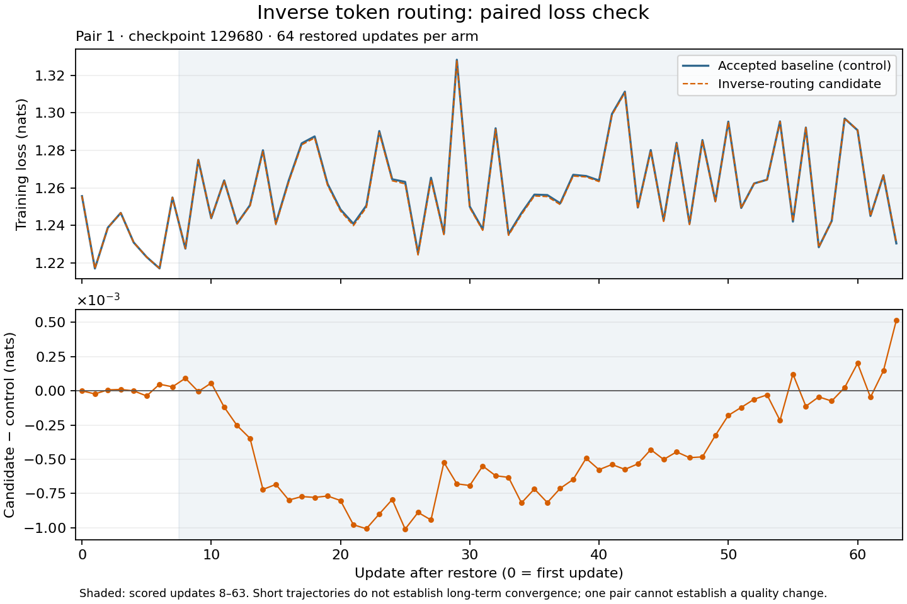

# Inverse token routing: first restored-training pair

Replacing inverse-permutation sorting with indexed writes measured +1.60% step throughput in one restored-training comparison on 64 NVIDIA GB200 GPUs. Rank-0 peak JAX allocation differed by less than 1 KiB. All 4,096 paired input fingerprints matched. This is an exploratory result: one pair cannot estimate between-run uncertainty, and small loss differences remain unexplained. The candidate has not been adopted into the research baseline.

The change restores token order after mixture-of-experts routing by writing `inverse[p[i]] = i`, using each permutation position exactly once. It preserves expert-key sorting and floating-point reductions in the source. Earlier [component measurements](inverse_routing_component_results.md) found 8.34–8.71% shorter token-combine and dispatch-gradient calls with zero observed output differences in the measured cases.

## Training measurement

| Metric | Control | Candidate |
| --- | ---: | ---: |
| Mean scored step time | 15.023108 s | 14.786954 s |
| Mean scored instrumented iteration time | 15.285043 s | 15.015993 s |
| Rank-0 JAX allocator lifetime peak | 103.088165 GiB | 103.088166 GiB |
| GPU-0 compiler-planned default-device plus collective allocation | 121.486589 GiB | 121.486590 GiB |

Both arms restored the same latest completed hero checkpoint selected at pair setup, step 129680. Control ran first, then candidate, in fresh processes on the same physical 64 GPUs across 16 hosts in one NVLink rack. Each arm ran 64 updates; all zero-based updates 8–63 were scored. The workload used 1,024 sequences per update, sequence length 4,096, 48 transformer layers, hidden width 6,144, 384 routed experts and top-8 routing. The production MuonH/AdamH/Adam optimizer retains learning-rate schedules and a fixed denominator-stabilizing epsilon configured for 11,264 sequences and a 390,251-update run. Restored optimizer counters advance once per benchmark update; epsilon is not scheduled. Full-production-batch throughput was not measured.

The primary estimate is control mean step time divided by candidate mean step time, minus one. The 56 scored updates are correlated observations within one run, not independent run replicates. There is no between-run confidence interval. Order effects remain possible because this pair ran control first.

Input hashing runs before the step timer and synchronizes local input shards. Its cost is excluded from the primary score but included in instrumented iteration time, whose throughput increased by 1.79%. That secondary metric also includes callbacks, logging and other host work; it does not measure uninstrumented production iteration throughput.

## Correctness, memory and compiled operations

The reported training loss is the token-weighted global mean of next-token cross-entropy plus `1e-4 × logsumexp(logits)²`. Router z-loss is logged separately and excluded. All 128 losses were finite. The first losses matched exactly. Across 64 updates, candidate-minus-control loss averaged −0.0003913 nats, reached a maximum absolute difference of 0.0010096 nats, and ended at +0.0005153 nats. The last-seven-update mean was +0.0001029 nats. These short trajectories do not establish unchanged convergence or a quality improvement.

Every rank's input digest matched at every update: 4,096 comparisons, with no missing, duplicate or mismatched records after collection recovery. Router metrics are available for 63 updates per arm, with 62 updates shared between arms. The data lists the missing router observations explicitly: control step 129719 and candidate step 129725. Padding metrics match over those 62 updates, while other router metrics differ. The cause of the loss differences remains unresolved.

The two-update GPU-0 profiles confirm removal of both inverse-sort operations and preservation of the two expert-key sorts. Both arms retain segmented forward attention and native SM100 backward attention. Dense matrix-multiply kernel names and launch counts match across all 59 compared operation groups. This comparison does not cover every floating-point operation or GPU rank.

The reported allocator peak includes initialization and compilation and excludes other allocators and devices. Compiler-planned allocations are a separate accounting view, not measured physical peak memory. Neither view shows a material increase in its measured scope. No out-of-memory failure occurred.

## Provenance and next decision

The baseline is main `1f9c387b6c45` plus the accepted SM100 backward-attention changes from [PR #9228](https://github.com/marin-community/marin/pull/9228), retaining ragged-all-to-all-only symmetric registration. Control is `9562c0779564`; candidate is `c2b3a4e8db9d`; the frozen harness is `0ece13c0101ef`. Training job `/mwittmann/hero2-inverse-paired-20260920-1158-p1` and its regional CPU analysis succeeded. Original checkpoint-retention metadata was restored after both arms finished.

The initial collector excluded 187 input fingerprints embedded in oversized log entries. A bounded projection recovered the fingerprint and its adjacent rank tag. All 8,649 originally collected records remained unchanged; completeness, ordering and equality checks then passed. All 260 selected timing/loss log records were separately verified to begin with rank 0. Training was not rerun, and neither scoring nor acceptance criteria changed.

[The summary and protocol](inverse_routing_training_results.json) and [compressed detailed record](inverse_routing_training_record.json.gz) include per-update metrics, derived profiles, source hashes, collection code, benchmark scripts and the collection-recovery record. Production candidate code remains local, so these artifacts do not provide a self-contained training rerun. Raw profiles, checkpoint contents and credentials are excluded.

A [same-code follow-up](inverse_routing_repeatability_results.md) observed a maximum loss difference of 0.000957 nats with all input fingerprints matching. It used checkpoint 129885, so it does not establish numerical equivalence for this candidate. Before promotion, collect independent control/candidate pairs with alternating run order and continue numerical review. Freeze the follow-up protocol before additional GPU work.
